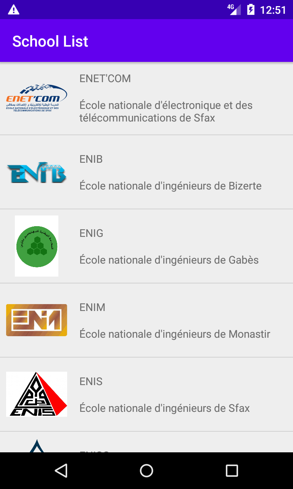

# TD Exercise 4

## Aperçu

//TODO change screenshot

"**`School List`**" est une application Android qui affiche une liste des écoles d'ingénieurs.

## A faire

L'application "`School List`" charge les données à partir d'Internet ([schools_list.json](https://raw.githubusercontent.com/khammami/td-data-2021/main/assets/json/schools_list.json)),les sauvegardes dans une base de données SQLite à l'aide de la bibliothèque Room et utilise la bibliothèque [Picasso](https://square.github.io/picasso/) pour charger les images.

La liste des écoles est incomplète et pour la compléter on doit modifier notre application en ajoutant des options qui permettent l'ajout, la modification ou la suppression d'une école, tout en exploitant l'activité qui affiche les détails d'une école.

- Modifier la mise en page (layout) de l'activité "`MainActivity`" pour qu'elle correspond la mise en page générée à partir du modèle "`Basic Activity`".
- Utiliser le bouton `FAB` pour lancer "`SchoolActivity`" et ajouter une nouvelle école.
- Modifier l'activité "`SchoolActivity`" pour qu'elle permette l'affichage, l'édition ou l'ajout d'une école.
- Ajouter un menu à l'activité "`SchoolActivity`" qui qui contient deux éléments:
  - "`SAVE`": pour sauvegarder et quitter l'activité.
  - "`Delete`": pour la suppression ou l'annulation d'ajout de l'école actuelle.
- Le button de navigation Android "`Back`" assure le retour à l'activité principale, l'annulation de création d'une école dans le cas de l'ajout ou l'annulation des changements en cas de modification dans l'activité "`School Activity`".

//TODO ADD a screenshot for SchoolActivity
